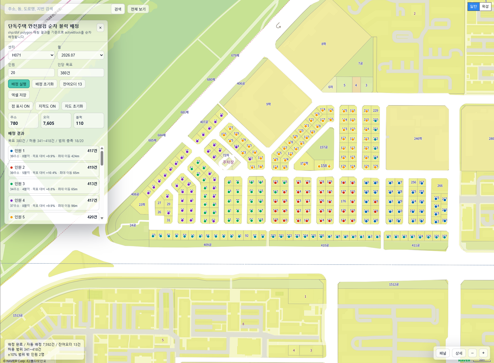

# 안전매니저 인원 배치 지도 (`assign_map`)

단독주택 안전점검 오더를 주소 좌표와 지적도 기반 블럭에 연결하고, 서비스처리센터의 안전매니저에게 **균등하면서도 현장에서 따라가기 쉬운 연속 구역**으로 배정하는 로컬 웹 도구입니다.



## 1. 핵심 원칙

배정 결과는 다음 우선순위를 지킵니다.

1. **인원별 오더 균등 분배:** 배정 가능 오더 기준으로 인당 목표의 ±10%를 강제한다.
2. **섬오더 선분리:** 일반 순로에 안전하게 연결되지 않는 작은 원격 묶음은 목표 계산과 자동 배정에서 먼저 뺀다.
3. **블럭·행정동 연속성:** 같은 블럭을 한 사람에게 통째로 배정하고, 가능하면 행정동을 섞지 않는다.
4. **연속된 순로:** 블럭을 하나의 거대한 지그재그 순로로 정렬한 뒤, 목표량에 가까운 연속 구간으로 자른다.
5. **현장 작업 순서:** 블럭을 순서대로 돌고, 블럭 내부 주소도 진입 방향에 맞춰 차곡차곡(stacd) 이어서 정렬한다.

거리·동선 최적화는 중요하지만, 위의 균등 분배 및 지리적 연속성을 깨는 경우에는 보조 기준으로만 사용합니다.

## 2. 현재 구성과 데이터 흐름

```text
엑셀 업로드
  → 주소 정규화·지오코딩 캐시 조회(네이버 Geocoding API 호출)
  → 전처리 주소에 대한 json 파일 생성
  → 연속지적도 필지 매칭
  → 도로·교통장벽·법정동을 반영한 구역별 할당 블럭 생성
  → SHP 데이터 기반 지적도 상 블럭 단위 경계값 분할
  → 지도에서 인원 입력·배정·검증·엑셀 내보내기
```

네이버 API는 주소를 좌표로 바꾸고 지도를 표시하는 용도입니다. 블럭 번호를 네이버 지도 화면에서 인식하거나 도로별 블럭 경계를 API로 추정하는 방식에는 의존하지 않습니다. 블럭의 경계·인접성은 버전이 관리되는 **연속지적도(SHP)** 와 도로/교통장벽 SHP에서 만들므로, 결과를 재현하고 검증할 수 있습니다.

## 3. 디렉터리 구조

아래 구조는 2026-07-30 현재 로컬 `assign_map` 폴더와 대조한 결과입니다. `road/`와 `transport/`는 현재 폴더에 없으므로, 신규 블럭 재생성 시에는 별도로 준비해야 합니다.

```text
assign_map/
├─ .gitignore                          # 로컬 키·업로드 파일·실행 산출물 제외 규칙
├─ app.py                              # FastAPI 서버, 업로드/재처리/엑셀 API
├─ daejeon_map.html                    # 운영 지도 화면
├─ 07.07.11.html                       # 지도 화면 스냅샷/대체 HTML
├─ run_assign_map.bat                  # Windows 실행 스크립트(포트 8010)
├─ requirements.txt                    # Python 의존성
├─ process_geocode.json                # 주소·좌표·오더 가공 결과
├─ processed_assignment_blocks.json    # 최종 블럭·neighbor 데이터
├─ image/README/1785370961313.png       # 이 README의 배정 화면 이미지
├─ 07.06/
│  ├─ preprocess_blocks.py             # 주소↔필지 매칭, 기본 블럭 생성
│  └─ preprocess_transport_blocks.py   # 장벽·법정동 반영 assignment block 생성
├─ admin/
│  ├─ admin.html                       # 엑셀 업로드·재처리 관리자 화면
│  ├─ README.md                        # 관리자 화면 설명(참고용 기존 문서)
│  └─ api_keys.json                    # 현재 로컬에 있는 키 파일(앱은 루트 키를 참조)
├─ boundary_map/
│  ├─ generate_selected_block_maps.py  # 블럭 경계 검증 지도 생성
│  ├─ generate_route_debug_maps.py     # 순로·neighbor·배정 검증 지도 생성
│  └─ assign_h074_33_sequential.py     # H074 순차 배정 검증용 스크립트
├─ block_geocodes/                     # 연속지적도 SHP 및 부속 파일
├─ dong/                               # 법정동 경계 SHP 및 부속 파일
├─ geocodes/
│  └─ geocoding.json                   # 네이버 지오코딩 캐시
├─ uploaded_workbooks/                 # H051~H075, 2026.07 원본 엑셀
└─ __pycache__/                         # Python 실행 캐시(배포·커밋 불필요)
```

현재는 `block_geocodes/`, `dong/`, 지오코딩·가공 JSON 및 업로드 원본 엑셀이 존재합니다. 반면 `road/`, `transport/`, 루트 `api_keys.json`, `assign_map.exe`, `_internal/`은 존재하지 않습니다. 도로·교통장벽을 반영해 새로 전처리하려면 두 SHP 폴더를 추가해야 하고, 앱이 네이버 API를 사용하려면 `admin/api_keys.json`이 아니라 루트 `assign_map/api_keys.json`을 별도로 둬야 합니다.

`road/`와 `transport/`이 없어도 이미 만들어진 `processed_assignment_blocks.json`으로 지도 확인과 기존 결과 조회는 가능합니다. 다만 업로드 후 재처리 또는 신규 블럭 생성은 실패합니다.

## 4. 설치와 실행

Python 3.11 이상을 권장합니다.

```powershell
cd C:\DA\assign_map
py -m venv .venv
.\.venv\Scripts\Activate.ps1
pip install -r requirements.txt
python app.py --open-browser
```

기본 접속 주소는 다음과 같습니다.

```text
지도:     http://127.0.0.1:8010/
관리자:   http://127.0.0.1:8010/admin
```

Windows에서는 `run_assign_map.bat`을 실행해도 됩니다. 이 스크립트는 같은 PC에서 이미 사용 중인 8010 포트를 정리한 후 서버를 실행합니다.

### 로컬 서버 공유

관리자 PC에서 `run_assign_map.bat`을 실행한 뒤, 같은 사내망 사용자는 `http://관리자PC_IP:8010/`으로 접속할 수 있습니다. 접속이 되지 않으면 서버 실행 상태, 같은 사내망 여부, Windows 방화벽의 TCP 8010 허용, 네이버 지도 Web 서비스 URL 등록을 확인합니다.

실행 파일(`assign_map.exe`)로 배포하는 경우에도 EXE만 전달하면 안 됩니다. `daejeon_map.html`, `admin/`, JSON 캐시, 필요한 SHP 및 `_internal/`을 포함한 **assign_map 폴더 전체**를 전달해야 합니다.

## 5. 월별 데이터 갱신

원본 파일은 아래 이름, 시트 및 열을 지켜야 합니다.

```text
파일명: H[센터코드]_YYYY.MM_안전점검.xlsx
예:     H074_2026.07_안전점검.xlsx
시트:   안전점검
필수:   주소, 센터
대상 센터: H051, H071, H072, H073, H074, H075
```

관리자 화면에서 파일을 업로드하고 갱신합니다.

1. `http://127.0.0.1:8010/admin`에 접속한다.
2. 규칙에 맞는 `.xlsx` 파일을 선택해 업로드·갱신한다.
3. 업로드 파일은 `uploaded_workbooks/`에 저장되고, 지오코딩·필지 매칭·assignment block 생성이 순서대로 실행된다.
4. 완료 후 지도 화면을 새로고침하고 월/센터, 오더 수, 좌표 이상 여부, 배정 및 엑셀 저장을 확인한다.

이미 `uploaded_workbooks/`에 둔 유효한 파일 전체를 다시 처리하려면 관리자 화면의 재구축 기능(`POST /api/rebuild`)을 사용합니다. 기존 지오코딩 캐시를 우선 쓰므로 같은 주소를 불필요하게 재호출하지 않습니다.

## 6. 배정 방법론 — 방법 1 (2026-07-06)

### 6.1 용어와 계산식

- **오더:** 주소별 작업 수의 합계.
- **블럭:** 실제로 연결된 필지들을 묶은 최소 지리 단위(`assignment block`). 주소를 임의 격자로 나눈 단위가 아니다.
- **순로(route):** 한 센터·행정동에서 블럭을 방문하는 전체 순서.
- **컴포넌트(component):** 일반 순로가 허용된 edge만으로 연결된 블럭 묶음.
- **섬오더(residual/island):** 자동 배정 순로에서 제외하여 관리자 검토·수동 배정하는 오더.

센터별 배정 가능 오더를 `A`, 투입 인원을 `P`라 하면 다음과 같이 계산합니다.

```text
target    = A / P
minTarget = target × 0.90
maxTarget = target × 1.10
```

`A`에는 섬오더를 포함하지 않습니다. 따라서 섬오더 선분리 후에 목표량을 다시 계산합니다. 사람 수는 양의 정수여야 하며, 각 컴포넌트의 사람 수는 그 오더 비중에 맞춰 먼저 정합니다.

### 6.2 블럭 neighbor 판정

블럭 간 거리는 폴리곤 **경계 간 최소 거리**를 우선 사용하고, 중심점 거리는 보조 판정에만 사용합니다. 도로·철도·하천·대형 도로 등 교통장벽을 가로지르는 edge는 거리 조건을 충족해도 차단합니다.

| 관계           | 판정                                             | 일반 순로 사용  | 의미                                            |
| -------------- | ------------------------------------------------ | --------------- | ----------------------------------------------- |
| `touches`    | 공유 경계 길이 ≥ 1 m, 경계 거리 ≤ 3 m          | 허용(최우선)    | 실제로 붙은 필지/블럭                           |
| `near`       | 경계 간격 ≤ 18 m, 중심점 ≤ 90 m, 교통장벽 없음 | 허용            | 골목·생활도로를 사이에 둔 블럭                 |
| `weak_bride` | 18 m 초과, 500 m 이내, 장벽 없음                 | 원칙적으로 금지 | 예외 연결 후보. 매우 큰 패널티가 있을 때만 검토 |
| `blocked`    | 500 m 초과 또는 교통장벽 존재                    | 금지            | 잔여 또는 별도 컴포넌트 처리                    |

현재 전처리기는 `touches`와 `near`의 후보 및 도로·교통장벽·법정동 메타데이터를 생성합니다. `weak_bridge`/`blocked`, 섬오더 선분리, 최종 순로 절단은 배정·검증 단계에서 위 정책으로 적용·검증하는 기준입니다.

### 6.3 500 m 제한과 섬오더

1. `touches`와 `near`만 사용해 route graph와 컴포넌트를 만든다.
2. 모든 블럭의 500 m 이내 연결 가능성을 확인한다. 장벽을 넘는 연결은 거리와 무관하게 불가로 본다.
3. 어느 허용 컴포넌트에도 500 m 이내로 연결되지 않고, 그 블럭 오더가 인원 1명 최소 목표치보다 작으면 섬오더로 선분리한다.
4. 섬오더를 제외한 오더로 `target`을 재계산한다.
5. 목표량 이상인 큰 블럭/컴포넌트는 그 자체의 오더 비율로 필요한 사람 수를 먼저 배정한다. 블럭 하나가 `maxTarget`을 넘으면 연속된 내부 주소 묶음으로만 분할할 수 있다.
6. 자동 배정 후에도 사람별 배정에 500 m 초과 고립 묶음이 남으면 해당 묶음을 다시 잔여로 되돌린다.

섬오더는 배정 실패가 아니라 별도 관리 대상입니다. 엑셀과 지도에 `잔여 사유`를 남기고, 현장 여건을 본 뒤 수동 배정합니다.

### 6.4 거대한 순로 생성

순로는 센터별로 독립적으로 생성하고, 같은 센터 안에서도 행정동과 허용 컴포넌트를 넘나들지 않습니다.

1. 행정동별 시작 모퉁이를 선택한다. 기본은 **NW → SE**이고, 센터별로 `NW`, `NE`, `SW`, `SE`를 설정할 수 있다.
2. 시작 방향을 기준으로 블럭 중심을 행(row)으로 나눈다.
3. 한 행에서는 좌→우, 다음 행에서는 우→좌로 진행하는 **지그재그 scanline** 순서로 블럭을 놓는다.
4. 현재 블럭에서 다음 블럭을 고를 때는 아래를 차례로 비교한다.
   1. `touches`
   2. `near`
   3. 현재 scanline 진행 방향과의 일치
   4. 짧은 블럭 간 거리
   5. 오더 수(동률의 마지막 결정 기준)

이 순서는 단순 블럭 번호·지번 번호 순서보다 실제 지리적 연속성을 우선합니다. 끊어진 컴포넌트 사이를 억지로 이어서 한 순로처럼 표시하지 않습니다.

### 6.5 인원별 순차 절단과 블럭 내부 stack

거대한 순로의 누적 오더를 따라가면서 한 사람의 `target`에 가장 가까운 **연속 블럭 구간**에서 절단합니다. `minTarget`~`maxTarget` 밖으로 벗어나는 후보에는 다른 모든 비용보다 훨씬 큰 패널티를 줍니다.

블럭은 기본적으로 한 사람의 소유 단위입니다. 불가피하게 큰 블럭을 나눌 때만 아래 규칙을 따릅니다.

1. 이전 블럭에서 들어오는 방향을 `entry vector`로 정한다.
2. 블럭 내부 주소를 entry 방향의 반대편부터 투영 좌표 순으로 정렬한다.
3. 같은 축에서 겹치는 주소는 수직축 순서로 정렬하여 한 줄씩 쌓이도록 한다.
4. 다음 블럭으로 나가는 출구와 가까운 끝에서 마치도록 필요 시 정렬 방향을 반전한다.
5. 분할된 조각은 서로 섞지 않고, 각각 연속된 주소 범위로 유지한다.

즉, 결과의 주소 번호는 단순 방문 경로를 뜻하지 않는 보조 정렬값이 아니라, 블럭 순서와 진입/이탈 방향을 반영한 현장 작업 목록입니다.

### 6.6 목적함수와 예외 우선순위

후보 배정의 점수는 아래 요소를 합산하되, 앞 항목일수록 압도적으로 큰 가중치를 사용합니다.

```text
score =
  균등 분배 위반 패널티
  + 행정동 변경 패널티
  + 블럭 분리/색 혼합 패널티
  + weak_bridge·장거리 이동 패널티
  + scanline 역행·동선 거리 패널티
```

우선순위는 `±10% 균등 분배` → `섬오더 자동 제외` → `행정동 유지` → `블럭 통째 배정` → `인접 블럭 연속성` → `주소/동선 정렬`입니다. 균등 분배가 구조적으로 불가능한 경우에는 이유(대형 블럭, 컴포넌트 크기, 잔여 분리)를 결과에 기록하고 관리자 판단을 요청합니다.

### 6.7 현재 자동화 구현과 AI 적용 범위

현재 운영 시스템은 생성형 AI나 학습 모델을 사용하지 않습니다. 입력이 같으면 같은 결과를 내는 규칙·공간 분석·그래프·동적계획법(DP) 기반 자동화이며, 배정 근거를 설명하고 재현하기 위한 선택입니다.

| 단계                 | 현재 자동화 구현                                                                                 | 상태                                                   |
| -------------------- | ------------------------------------------------------------------------------------------------ | ------------------------------------------------------ |
| 데이터 정제          | 파일명·시트·대상 용도 검증, 주소별 오더·세대·유형 집계                                       | 구현됨                                                 |
| 좌표 확보            | 지오코딩 캐시 → 네이버 지오코딩 후보 주소 재시도 → 유일한 기본주소 매칭 → 동 중심점 추정 좌표 | 구현됨                                                 |
| 공간 블럭            | 필지 공간매칭, 공유경계·경계거리 판정, 도로/교통장벽·법정동 반영, Union-Find 병합              | 구현됨                                                 |
| 순로 생성            | neighbor 우선 최근접 블럭 순회, 500 m 이내 컴포넌트/cluster 구성, 블럭 내부 최근접 주소 정렬     | 구현됨                                                 |
| 인원 분할            | 연속 주소 단위 DP 절단, 목표 편차·±10% 이탈·동일 블럭 분할·500 m 이동에 큰 패널티            | 구현됨                                                 |
| 품질 검증            | 중복/미배정, ±10% 위반, 블럭 재진입, 최대 이동거리, 잔여 사유 검사                              | 구현됨                                                 |
| scanline 지그재그    | NW→SE 행 단위 지그재그 순로                                                                     | 목표 방법론; 운영 화면에는 아직 직접 구현되지 않음     |
| `weak_bridge` 예외 | 18~500 m edge를 큰 패널티로 제한적으로 사용하는 정책                                             | 목표 방법론; 현재 일반 배정은 500 m 초과를 잔여로 분리 |
| 실제 도로 이동시간   | 차량·도보 도로망, 교통량, 출발/종료지 기반 경로                                                 | 미구현                                                 |
| 학습형 AI            | 과거 수동 조정·현장 완료시간을 학습해 배정안을 추천                                             | 미구현                                                 |

동 중심점 추정 좌표(`dong_centroid_estimate`)는 실제 위치가 아니므로, 이 좌표를 가진 주소는 자동 배정 전후에 별도 확인 대상이어야 합니다. 추후 AI를 추가한다면 배정 결과를 자동 확정하는 용도보다, 주소 오류 탐지·현장 소요시간 예측·수동 조정안 추천에 한정하고 최종 배정은 위의 하드 제약과 관리자 검토를 유지합니다.

## 7. 블럭 재생성과 검증

신규 원본 데이터로 블럭을 다시 만들 때는 두 단계로 실행합니다. 앱의 업로드·재처리도 같은 순서를 내부적으로 수행합니다.

```powershell
cd C:\DA\assign_map

# 1) 주소 좌표를 연속지적도 필지에 매칭
python 07.06\preprocess_blocks.py `
  --input process_geocode.json `
  --shp block_geocodes\LSMD_CONT_LDREG_30_202607.shp `
  --output _processed_blocks_tmp.json

# 2) 도로·교통장벽·법정동을 반영해 assignment block 생성
python 07.06\preprocess_transport_blocks.py `
  --processed _processed_blocks_tmp.json `
  --transport transport\AL_D142_00_20260609.shp `
  --road road\C_UQ151.shp `
  --dong dong\LSMD_ADM_SECT_UMD_30_202606.shp `
  --output processed_assignment_blocks.json
```

H072/H074의 블럭 경계와 순로 결과는 다음 명령으로 검증합니다.

생성되는 `boundary_map/assignment_blocks_H*.html`과 `boundary_map/debug_route_H*.html`에서 다음을 확인합니다.

- 블럭 경계와 주소 점의 매칭, 미매칭 주소 여부
- `touches`/`near` edge와 장벽·행정동 경계로 제외된 edge
- 컴포넌트와 500 m 이내 cluster, 섬오더·잔여 사유
- scanline 순로, 인원별 연속 블럭 구간, 블럭 색 혼합 여부
- 인원별 오더 수와 `target` 대비 편차, 큰 블럭 분할의 연속성

## 8. 결과와 운영 점검

지도에서 내보낸 결과는 보통 다음 형식으로 저장됩니다.

```text
H074_2026.07_인원배정.xlsx
```

외부 전달용 엑셀에는 센터, 월, 주소, 도로명/지번, 동, 담당 인원, 오더 정보를 넣고, 내부 분석용 `block_id`, 거리, 매칭 방식, 잔여 사유 등은 필요할 때만 별도 검증 결과로 보관합니다.

월별 갱신 또는 배포 전에는 아래를 확인합니다.

- 새 월/센터가 화면에 나타나고 원본 대비 주소·오더 합계가 일치하는가
- 좌표가 대전·계룡·충남 등 운영 권역 밖으로 과도하게 벗어나지 않는가
- `processed_assignment_blocks.json`이 현재 입력 데이터와 같은 기준일의 SHP로 생성되었는가
- 모든 일반 배정이 허용 edge로 연결되며, 500 m 초과 고립 오더가 잔여로 표시되는가
- 사람별 오더가 ±10% 범위를 지키는가. 예외라면 사유가 남아 있는가
- 지도, 관리자 업로드, 엑셀 내보내기가 정상 동작하는가

## 9. 문제 해결

| 증상                  | 확인 사항                                                                                                                  |
| --------------------- | -------------------------------------------------------------------------------------------------------------------------- |
| 지도가 보이지 않음    | 인터넷 연결,`api_keys.json`, 네이버 Web 서비스 URL, `http://127.0.0.1:8010` 접속 주소를 확인                           |
| 새 월 데이터가 없음   | 파일명·`안전점검` 시트·필수 열을 확인하고 관리자 화면에서 업로드/재처리 후 새로고침                                    |
| 지오코딩이 이상함     | 도로명·지번 주소의 완전성, 운영 권역,`geocodes/geocoding.json` 캐시를 확인                                              |
| 블럭 재생성 실패      | `block_geocodes/`, `road/`, `transport/`, `dong/`의 SHP와 부속 파일(`.dbf`, `.shx`, `.prj`) 존재 여부를 확인 |
| 다른 PC에서 접속 불가 | 서버 실행 상태, 관리자 PC IP, 사내망, TCP 8010 방화벽, 네이버 URL 등록을 확인                                              |
| EXE 실행 실패         | EXE만 복사하지 않았는지, 같은 폴더의 HTML/JSON/`_internal`과 필요한 데이터가 함께 있는지 확인                            |

## 10. 보안과 버전 관리

주소·좌표가 담긴 JSON, 원본 SHP 및 실행 로그는 공개 저장소에 올리지 않습니다. 배포 데이터는 접근 권한이 있는 별도 보안 저장소에서 관리합니다. 재생성에 사용한 SHP의 기준일과 배정 결과의 기준 월을 함께 기록해, 나중에 같은 결과를 재현할 수 있게 합니다.
